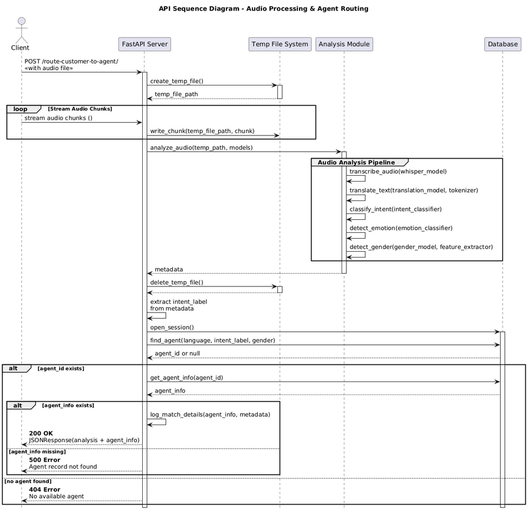
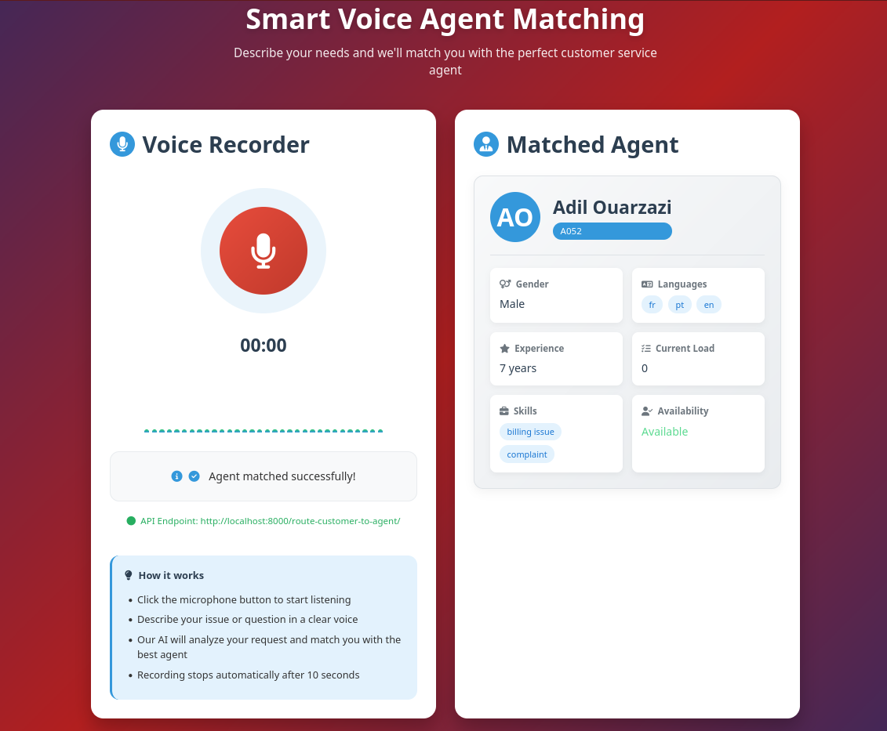

# Voice-Driven Customer Support Router

## Overview

This project provides an intelligent audio-based customer routing service designed to enhance call center efficiency. By analyzing uploaded audio recordings with advanced deep learning models—covering speech transcription, language translation, intent classification, emotion detection, and gender recognition—it extracts rich metadata to understand the caller’s needs and profile. Using this data, the system automatically matches the customer with the most suitable available agent from the database, ensuring faster, more accurate routing and improved customer experience. This solution addresses the common problem of inefficient call routing in customer support by leveraging AI-powered insights from audio inputs.

## Sequence diagram

<div align="center">
  
</div>


## Usage 
- First, install the project requirements:
```
pip install -r requirements.txt
```
- To run the FastAPI server, execute:
```
uvicorn main:app
``` 
- Then, navigate to `src/ui/index.html` to test the user interface.

## Interface

<div align="center">
  
</div>
